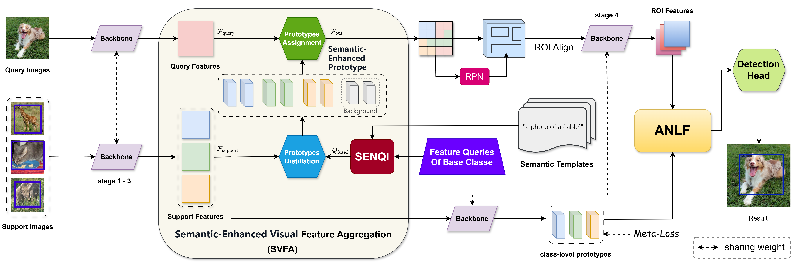

## Introduction

This repository contains the implementation of **SVFA (Semantic Visual Feature Aggregation)**, a novel approach for few-shot object detection. The method leverages semantic visual features and prototype distillation to improve few-shot learning performance.



This implementation is based on [MMFewShot](https://github.com/open-mmlab/mmfewshot) framework.

## Features

- **Semantic Visual Feature Aggregation**: Leverages CLIP-based semantic features for better few-shot learning
- **Prototype Distillation**: Efficient knowledge transfer from base classes to novel classes
- **Multi-scale Feature Fusion**: Combines different levels of visual features for robust detection
- **Support for Multiple Datasets**: Compatible with VOC and COCO datasets
- **Flexible Configuration**: Easy to customize for different experimental settings

## Quick Start
```bash
# create a conda environment
conda create -n svfa python=3.8
conda activate svfa
conda install pytorch==1.12.1 torchvision==0.13.1 torchaudio cudatoolkit=11.3 -c pytorch -c conda-forge

# dependencies
pip install openmim
mim install mmcv-full==1.6.0
mim install mmcls==0.25.0
mim install mmdet==2.24.0
pip install -r requirements.txt

# install mmfewshot
pip install git+https://github.com/open-mmlab/mmfewshot.git
# or manually download the code, then
# cd mmfewshot
# pip install .

# install SVFA
python setup.py develop
```

## Prepare Datasets
Please refer to [mmfewshot/data](https://github.com/open-mmlab/mmfewshot/blob/main/tools/data/README.md)
for the data preparation steps.

## Evaluation

```bash
# single-gpu test
python test.py ${CONFIG} ${CHECKPOINT} --eval mAP|bbox

# multi-gpus test
bash dist_test.sh ${CONFIG} ${CHECKPOINT} ${NUM_GPU} --eval mAP|bbox
```

* Example: Test on VOC Split1 10-shot with 2 gpus:

```bash
bash dist_test.sh \
    configs/svfa/voc/split1/svfa_r101_c4_2xb4_voc-split1_10shot-fine-tuning.py \
    ${CHECKPOINT_PATH} 2 --eval mAP
```

* Example: Test on COCO 30-shot with 2 gpus:
```bash
bash dist_test.sh \
    configs/svfa/coco/svfa_r101_c4_2xb4_coco_30shot-fine-tuning.py \
    ${CHECKPOINT_PATH} 2 --eval bbox
```

## Training
```bash
# single-gpu training
python train.py ${CONFIG}

# multi-gpus training
bash dist_train.sh ${CONFIG} ${NUM_GPU}
```
* Training SVFA on VOC dataset with 2 gpus:
```bash
# base training
bash dist_train.sh \
    configs/svfa/voc/split1/svfa_r101_c4_2xb4_voc-split1_base-training.py 2
    
# few-shot fine-tuning
bash dist_train.sh \
    configs/svfa/voc/split1/svfa_r101_c4_2xb4_voc-split1_10shot-fine-tuning.py 2
```
* Training SVFA on COCO dataset with 2 gpus:
```bash
# base training
bash dist_train.sh \
    configs/svfa/coco/svfa_r101_c4_2xb4_coco_base-training.py 2
    
# few-shot fine-tuning
bash dist_train.sh \
    configs/svfa/coco/svfa_r101_c4_2xb4_coco_30shot-fine-tuning.py 2 
```

## License

This project is licensed under the MIT License - see the [LICENSE](LICENSE) file for details.

## Acknowledgments

- Thanks to the [MMFewShot](https://github.com/open-mmlab/mmfewshot) team for the excellent framework
- Thanks to [OpenAI CLIP](https://github.com/openai/CLIP) for the pre-trained vision-language model
